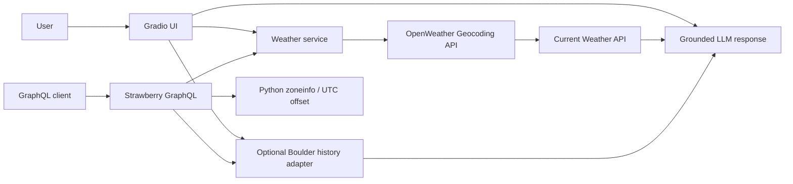

# Weather AI Assistant

A modernized weather assistant combining **live weather services, GraphQL, historical data, and grounded LLM responses**.

This project evolved from an earlier weather-assistant prototype that connected Gradio, Supabase, Strawberry GraphQL, OpenWeather, WorldTimeAPI, Flowise, Docker, and a Boulder historical dataset. The maintained implementation keeps the useful system-design ideas while removing unnecessary coupling and unsafe authentication patterns.

## Architecture



## What the project demonstrates

- external API integration with explicit timeouts and error handling
- geocoding before weather lookup
- typed domain models
- grounded LLM generation from verified measurements
- Strawberry GraphQL API
- Gradio UI
- optional historical-data adapter
- dependency injection for testable HTTP clients
- Docker / Docker Compose
- mocked unit tests with no network or API-key dependency

## Major changes from the original project

### OpenWeather geocoding is explicit

The original application queried current weather directly by city name. OpenWeather currently marks its built-in city-name geocoding as deprecated and recommends resolving locations through its Geocoding API before requesting weather by latitude/longitude.

The new pipeline is:

```text
location text
    ↓
OpenWeather Direct Geocoding
    ↓
latitude / longitude
    ↓
Current Weather API
```

This also keeps location resolution separate from weather retrieval.

### Flowise is no longer a runtime dependency

The maintained application performs deterministic data retrieval in Python first, then sends the **verified weather context** to the LLM. The model is responsible for conversational presentation, not for inventing or fetching weather measurements.

### No custom password database

The original Gradio application implemented account creation, login, and deletion by querying username/password values in Supabase tables.

That authentication layer has been removed.

A public weather demo does not need user accounts. If identity becomes a real product requirement later, it should use a dedicated authentication provider rather than application-managed plaintext credential comparisons.

### No WorldTimeAPI dependency

Current local time can be calculated using Python's standard `zoneinfo` database. Weather observations can also be localized directly using the UTC offset returned by OpenWeather.

### Historical Boulder data is an adapter

The application can optionally query a compatible Boulder daily-weather CSV when `BOULDER_HISTORY_CSV` is configured.

The source CSV stores temperatures in Fahrenheit. The adapter converts them to Celsius so current and historical context do not silently mix units.

The data file itself is not duplicated into the new project yet; its source and redistribution terms should be verified before the final standalone repository is created.

## Project structure

```text
.
├── app.py
├── graphql_app.py
├── Dockerfile
├── docker-compose.yml
├── src/weather_assistant/
│   ├── assistant.py
│   ├── config.py
│   ├── graphql_schema.py
│   ├── history.py
│   ├── models.py
│   ├── time_utils.py
│   └── weather.py
├── tests/
└── pyproject.toml
```

## Setup

Requires Python 3.11+.

```bash
python -m venv .venv
source .venv/bin/activate        # macOS/Linux
# .venv\Scripts\activate       # Windows

pip install -e ".[dev]"
cp .env.example .env
```

Configure:

```dotenv
OPENWEATHER_API_KEY=...
OPENAI_API_KEY=...
OPENAI_MODEL=gpt-5.6-luna
BOULDER_HISTORY_CSV=/path/to/boulder_weather.csv
```

`BOULDER_HISTORY_CSV` is optional.

## Run the conversational UI

```bash
python app.py
```

The UI runs on port `7860`.

The user supplies:

- a location
- a weather-related question
- optionally, a Boulder historical date in `YYYY-MM-DD`

Live measurements are shown separately from the generated answer so the grounding data remains inspectable.

## Run GraphQL

```bash
uvicorn graphql_app:app --reload --port 8000
```

Example query:

```graphql
{
  weather(city: "Granada, ES") {
    location
    localTime
    condition
    description
    temperatureC
    feelsLikeC
    humidityPercent
    windSpeedMps
  }
}
```

The schema also exposes local timezone calculation and, when configured, the Boulder historical adapter.

## Docker

Run both interfaces:

```bash
docker compose up --build
```

- Gradio: `http://localhost:7860`
- GraphQL: `http://localhost:8000`

The new Docker image deliberately uses a single straightforward installation stage. The original multi-stage Dockerfile installed dependencies in the builder image but copied only `/app` into the runtime image, so the installed Python packages were not reliably transferred.

## Security

API credentials belong only in environment variables.

During modernization an OpenWeather API key was found embedded in an earlier public prototype and was removed from the current repository state.

Because Git retains previous commits, removing a credential from the latest file does **not** invalidate the exposed credential. Any previously committed key should be rotated/revoked by its provider.

## Quality checks

```bash
ruff check .
pytest -q
```

The test suite covers:

- geocoding followed by coordinate-based weather lookup
- weather response mapping
- unknown locations
- Fahrenheit → Celsius historical normalization
- historical row retrieval
- timezone and UTC-offset conversion
- verified LLM context construction
- mocked Responses API invocation

No real OpenWeather or OpenAI requests run in CI.

## Design boundary: current weather vs forecast

This first modernization pass implements the capability that the original Python/GraphQL code actually exposed reliably: **current weather**, plus the local Boulder historical dataset.

Forecasting is deliberately not presented as implemented until a forecast provider is integrated and tested.

## Next steps before standalone portfolio release

- add 5-day forecast support through a dedicated provider interface
- cache weather responses by resolved location
- expose multiple geocoding matches instead of always selecting the first result
- add retry/backoff policy for transient provider errors
- validate the assistant on a small bilingual question set
- add GraphQL integration tests
- verify provenance/licensing for the Boulder historical CSV
- add screenshots and architecture/result visuals
- deploy a public demo

The maintained implementation is the canonical version of the project.
